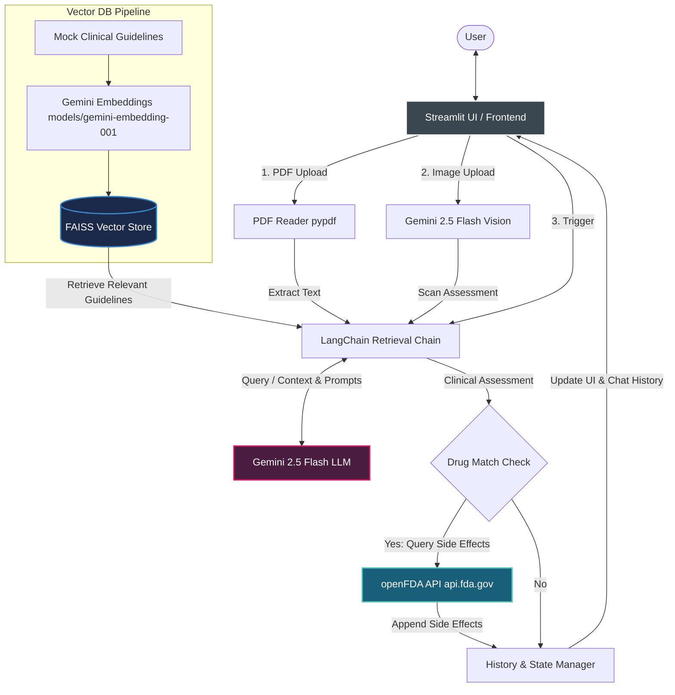
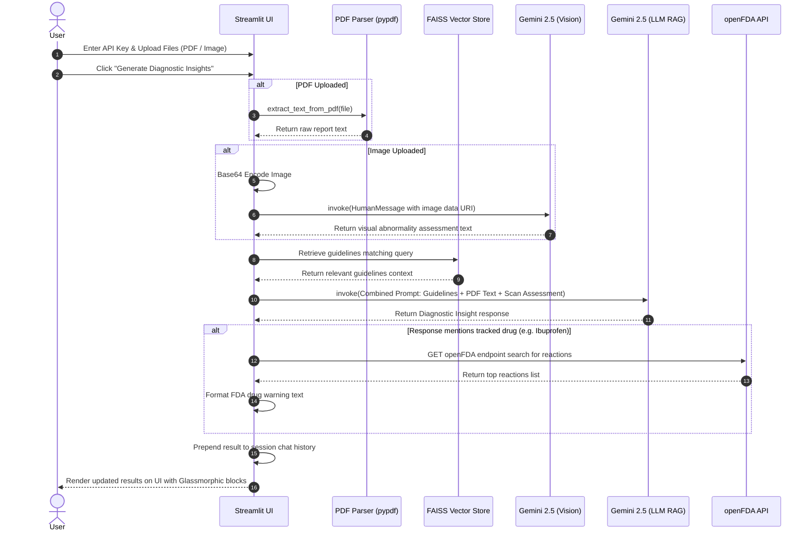

# Multimodal Clinical Decision Support System Architecture Flow

This document details the architecture, component interaction, and data flow of the Multimodal Clinical Decision Support System.

## Architecture Overview

The application is a Streamlit-based web tool that integrates **Retrieval-Augmented Generation (RAG)**, **Vision-Language Models (VLM)**, and **external APIs** to assist clinical decision-making. 

---

## Detailed Step-by-Step Flow

The table below breaks down the execution process chronologically:

| Phase | Step | Component | Action / Data Flow Description |
|:---|:---|:---|:---|
| **Initialization** | 1 | **Streamlit App** | Renders the Glassmorphism UI, requests the Google Gemini API key via the sidebar, and initializes the session state (`chat_history`). |
| | 2 | **Embeddings & FAISS** | Initializes `initialize_rag_database()` (cached via `@st.cache_resource`): embeds the 9 mock medical guidelines using `gemini-embedding-001` and loads them into a local `FAISS` vector store. |
| **Ingestion** | 3 | **PDF Document Uploader** | If a PDF is uploaded, `extract_text_from_pdf` reads pages using `pypdf.PdfReader` and extracts raw clinical/blood test text. |
| | 4 | **Image Scan Uploader** | If a medical scan image (X-Ray/MRI/CT) is uploaded, it is base64-encoded into a Data URI to be sent multimodally. |
| **Vision Analysis** | 5 | **Vision Model (VLM)** | Sends the base64 scan to `gemini-2.5-flash` with a system prompt instructions role ("You are a radiologist..."). It returns a text-based scan abnormality analysis. |
| **RAG Retrieval** | 6 | **Vector Store Retriever** | Queries FAISS vector store to retrieve guidelines relevant to the query input ("Analyze the patient data"). |
| **Clinical Reasoning**| 7 | **Stuff Documents Chain** | Combines retrieved guidelines, extracted PDF report text, and image scan analysis into a consolidated prompt template. |
| | 8 | **Inference** | Invokes `gemini-2.5-flash` to evaluate the combined context and generate clinical decision recommendations. |
| **Drug Safety Check** | 9 | **Demo Drug Matcher** | Scans the generated response text for any of the monitored demo drugs (Amoxicillin, Azithromycin, Lisinopril, Dexamethasone, Ibuprofen). |
| | 10 | **openFDA API Query** | If a drug matches, queries the FDA events endpoint `https://api.fda.gov/drug/event.json` to fetch the top 3 adverse drug reactions. |
| **Rendering** | 11 | **History & Presentation** | Appends the FDA warning info to the assessment, pushes it to the front of `st.session_state.chat_history`, and renders the result cards on screen. |

---

## Sequence Execution Flow

---

## Key Design Principles & Features

1. **Caching (`@st.cache_resource`)**:
   Prevents re-initializing the local FAISS database and downloading embeddings on every Streamlit widget rerun, drastically speeding up response times.
2. **Vision-to-Text Pipeline Integration**:
   Rather than passing raw image bytes direct into a complex single RAG chain, the model utilizes a two-step inference process:
   - *Step 1*: Isolate visual features (e.g., detecting shadows or midline shifts on brain MRIs) using a specialized visual prompt.
   - *Step 2*: Feed the textual visual assessment along with clinical notes to the primary RAG coordinator.
3. **Safety Guardrail instructions**:
   The prompt template explicitly restricts the LLM from forcing alignments to irrelevant guidelines (e.g., matching brain MRIs to community pneumonia standard treatments).
4. **FDA Drug Verification**:
   Uses real-time external data APIs (`openFDA`) to enrich the LLM suggestion with actual adverse reactions reported to the FDA.
